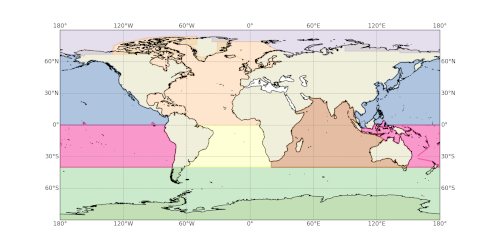

.. _aggregation:

Aggregate Existing Features
===========================

The :py:mod:`geometric_features.aggregation` module contains functions used to
aggregate existing features to make new, larger ones.  An example usage of these
aggregation functions is to create masks for regional averaging.

Aggregating Ocean Features
--------------------------

Ocean Sub-basins
~~~~~~~~~~~~~~~~

The function :py:func:`geometric_features.aggregation.ocean.subbasins`
aggregates oceanic regions to make the following ocean subbasins: North and
South Atlantic, North and South Pacific, Indian Basin, Arctic Basin, and
Southern Ocean Basin.

Ocean Basins
~~~~~~~~~~~~

The function :py:func:`geometric_features.aggregation.ocean.basins` aggregates
oceanic regions to make the following ocean basins: Atlantic, Pacific, Indian,
Arctic, Southern Ocean, Mediterranean, Global Ocean, Global Ocean 65N to 65S,
Global Ocean 15S to 15N.

Meridional Overturning Circulation Basins
~~~~~~~~~~~~~~~~~~~~~~~~~~~~~~~~~~~~~~~~~

The function :py:func:`geometric_features.aggregation.ocean.moc` aggregates
basins for computing the MOC: Atlantic, IndoPacific, Pacific and Indian

Arctic Regions
~~~~~~~~~~~~~~

The function :py:func:`geometric_features.aggregation.ocean.arctic` aggregates
regions of the Arctic: Baffin Bay, Baltic Sea, Barents Sea, Beaufort Gyre,
Beaufort Gyre Shelf, Canada Basin, Canadian Archipelago, Central Arctic, 
Chukchi Sea, East Siberian Sea, Greenland Sea, Hudson Bay, Irminger Sea, 
Kara Sea, Labrador Sea, Laptev Sea, North Sea, Norwegian Sea, and
Arctic Ocean - no Barents, Kara Seas.

Antarctic Regions
~~~~~~~~~~~~~~~~~

The function :py:func:`geometric_features.aggregation.ocean.antarctic` aggregates
regions of the Antarctic: Southern Ocean, Southern Ocean 60S,
Eastern Weddell Sea Shelf, Eastern Weddell Sea Deep, Western Weddell Sea Shelf,
Western Weddell Sea Deep, Weddell Sea Shelf, Weddell Sea Deep,
Bellingshausen Sea Shelf, Bellingshausen Sea Deep, Amundsen Sea Shelf,
Amundsen Sea Deep, Eastern Ross Sea Shelf, Eastern Ross Sea Deep,
Western Ross Sea Shelf, Western Ross Sea Deep, East Antarctic Seas Shelf,
East Antarctic Seas Deep.

Ice-shelf Regions
~~~~~~~~~~~~~~~~~

The function :py:func:`geometric_features.aggregation.ocean.ice_shelves`
aggregates ice shelves and ice-shelf regions.  There are 106 regions, so they
won't all be listed.  See the resulting feature collection or the code itself
for the full list.

Transport Transects
~~~~~~~~~~~~~~~~~~~

The function :py:func:`geometric_features.aggregation.ocean.transport`
aggregates transport transects:  Africa-Ant, Agulhas, Antilles Inflow,
Barents Sea Opening, Bering Strait, Davis Strait, Drake Passage,
Florida-Bahamas, Florida-Cuba, Fram Strait", Indonesian Throughflow,
Lancaster Sound, Mona Passage", Mozambique Channel, Nares Strait, Tasmania-Ant
Windward Passage.

Aggregating Sea-ice Features
----------------------------

Arctic Regions
~~~~~~~~~~~~~~

The function :py:func:`geometric_features.aggregation.seaice.arctic` aggregates
regions of the Arctic as defined by the
`National Snow and Ice Data Center (NSIDC) <https://nsidc.org/>`_ that are
relevant for sea ice: Baffin Bay NSIDC, Barents Sea, Beaufort Sea NSIDC,
Canadian Archipelago NSIDC, Central Arctic NSIDC, Chukchi Sea NSIDC,
East Siberian Sea NSIDC, Hudson Bay NSIDC, Kara Sea, Laptev Sea NSIDC.
